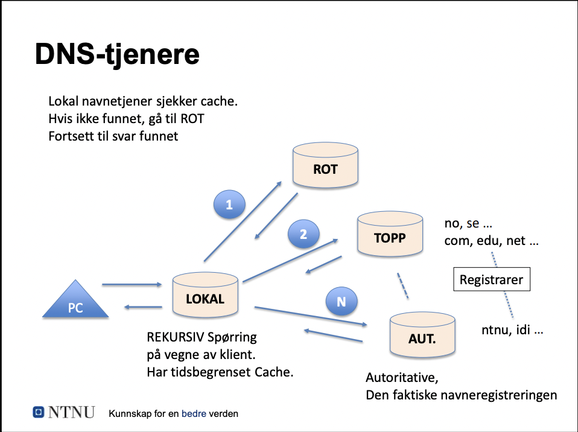
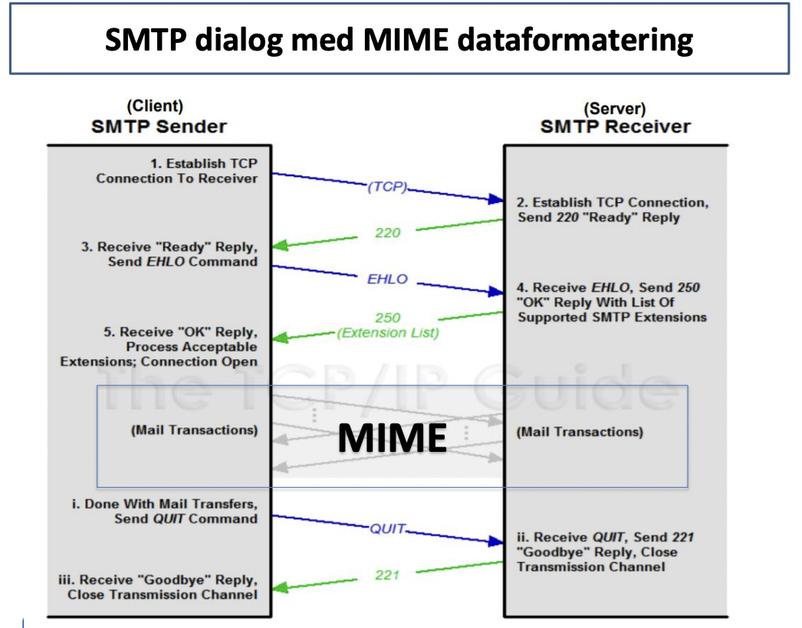
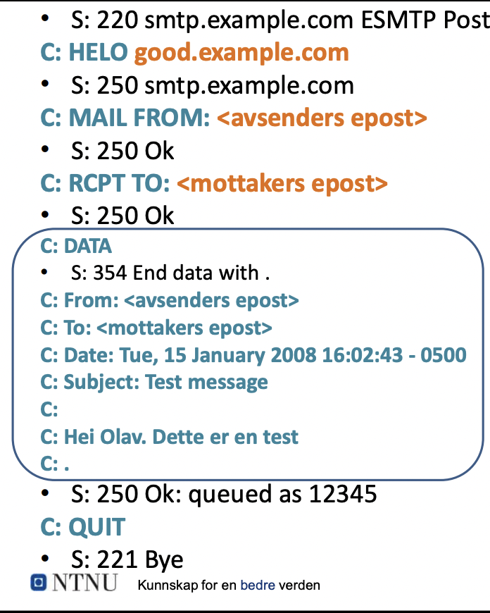

# Oppsummering datakom

# Uke 3 - Applikasjonslaget: Epost, web og navnetjenesten og HTTP

## Webtjenesten

Web tjenesten består av en klient som sender requests til web tjener og får respons tilbake med elementer som den skal vise. En nettside kan være bygget opp av elementer fra flere Web-tjenere.
Nettleseren henter først index-filen og skanner etter referanser til flere objekter som lastes ned i rekkefølge.

### HTTP-standard

HTTP/2 er en forbedring over HTTP/1.1 fordi den er mer effektiv via 2 ting. 

1. Den komprimerer header fielden
2. Den lar flere utvekslinger av informasjon skje på samme tilkobling.

#### Noen egenskaper med HTTP:

* **Den er "stateless"/tilstandsløs**. Dette vil si at den ikke har noe hukommelse og at interaksjoner er uavhengig av hverandre. Hvis man ønsker å ha hukommelse(netthandel, favoritter, osv...) må man bruke cookies/informasjonskapsler.

* **Self-descriptive message payloads**. Hver headerlinje i meldingen har navn og innhold i klartekst. Dette kalles kolonseparerte navn/verdipar. Det er også ingen fast lengde for meldingsheader, som betyr at man kan legge til nye headerlinjer for å støtte ny funksjonalitet.

#### Noen "mangler" som kan jobbes rundt i HTTP

1. **Vedvarende forbindelse**: TCP forbindelsen mellom klient og tjener koples ned etter hver request/response i HTTP/1.1, som regel trenger man flere objekter fra webtjener for å bygge opp en HTML-side. I tillegg sløser det tid og båndbredde å ha en serie av opp/ned koplinger.

    Dette løses ved at klienten kan sende en keep-alive request i headeren, tjeneren kan da svare med en timeout og et maks antall objekter som kan sendes før koplingen termineres.

2. **Cookies**: HTTP/1.1 er tilstandsløs så for å få vedvarende informasjon mellom sesjoner trenger vi cookies.

    Cookies fungerer ved at tjener oppretter en cookie som lagres hos klienten, neste gang klienten sender en request sender den også med cookie.

3. **Lokalt mellomlager(cache)**: Man gjør ofte oppslag på samme webside, objekter fra websiden lagres da i cache på PCen så de ikke må lastes ned hver gang.

    Klienten undersøker eget lager. Hvis den finner filen som skal brukes sender den datoen via - If-modified-since.
    Hvis filen er uendret siden da så svarer tjeneren med HTTP/1.1 304 Not modified. Da bruker pcen opp igjen filen.

4. **Webhotell(Web hosting)**: En webtjener har som regel mange nettsider, men en socket forteller deg ikke hvilken av dem du vil kontakte.

    For å få data fra riktig nettside sender klienten med URL i HTTP-requesten.
    - Host:datakom.no

### utveksling av meldinger

Klient sender en forespørsel(request) med oppbyggingen:

* request line
* Headerlinjer
* Evt. Body

Tjenser svarer(response) med oppbyggingen:

* Status linje (med kode og melding, f.eks 200-OK)
* Headerlinjer
* Body

**Request-linje format:** Method SP request-target SP HTTP-version CRLF

**Status-linje format:** HTTP-versjon SP status-code SP reason-phrase CRLF

SP er mellomrom. CRLF er slutten.

eks: GET /hello.txt HTTP/1.1 -> <- HTTP/1.1 200 OK

### HTTPS

HTTPS er en kryptert versjon av HTTP som bruker TLS "mellom" HTTP og TCP. Det er bare tjeneren som trenger sertfikat. HTTPS fungerer på denne måten:

1. Etablere TCP-forbindelse til tjenerport 443
2. Utveksle TLS-info (klientdata og tjenersertfikat)
3. Avtale sesjonsnøkler (for kryptering av meldinger)
4. Nå kan man starte å sende krypterte meldinger via HTTP standarden.

## DNS - Navnetjenesten

DNS skal finne IP-adressen for et domenenavn. Nettverket trenger IP-adressen for å overføre data. DNS kan også brukes for kontroll, gjøre et reversoppslag for å passe på at IP-adressen har domenenavnet den utgir seg for å ha.

Tjenesten er hierarkisk oppbygd, både i infrastruktur og forvaltning.

infrastruktur: Rottjenere, lokale navnetjenere, ...

forvaltning: Internasjonalt, regionalt, lokal registrering.

### Oppbygging av en URL

eks:

https://www.reddit.com <- Komplett URL

www.reddit.com <- Fully qualified domain name (FQDN)

www <- Sub domain

reddit <- second-level domain
        
com <- Top-level domain (TLD)

Domenenavn brukes av flere tjeneser enn web.
Generiske toppnivå-domener styres av ICANN.
Nasjonale toppnivå-domener styres delegert, eks NORID for no-domenet. Brukerdomener (eks NTNU) tilhører registrert eier som selv kan legge til subdomener (IDI).

Dette bildet viser hvordan DNS søker etter navn.
Rot-tjeneren vet ikke detaljene om det du søker etter, men den vet hvem du skal spørre. Ved å gå gjennom disse rekursivt ender du til slutt opp med.

## Epost

Simple Mail Transfer Protocol (SMTP) er den originale protokollen brukt for mail, denne er veldig simpel og har noen mangler som senere ble adressert via Multipurpose Internet Mail Extensions (MIME).

POP/IMAP er protokoller som blir brukt for å sende mail til klient, SMTP er en protokoll for å sende mail til tjener.

MIME er bare en utvidelse av SMTP som koder om innholder i mailen for å støtte andre tegnsett, vedlegg, ...

### MIME - Formatering av meldingsinnhold

* SMTP bruker US-ASCII tegnsett, 7-bit og meget begrenset.
* Filvedlegg og nasjonale tegnsett må kodes om.

### SMTP dialog med MIME dataformatering

### Oppbygging av en epost

Innholdet i den avsirklede seksjonen er MIME-seksjonen.

