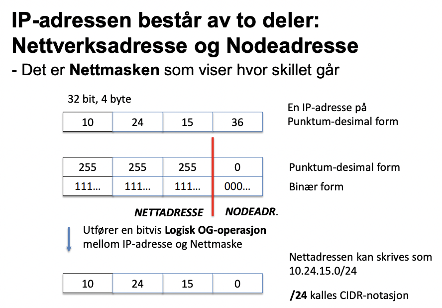
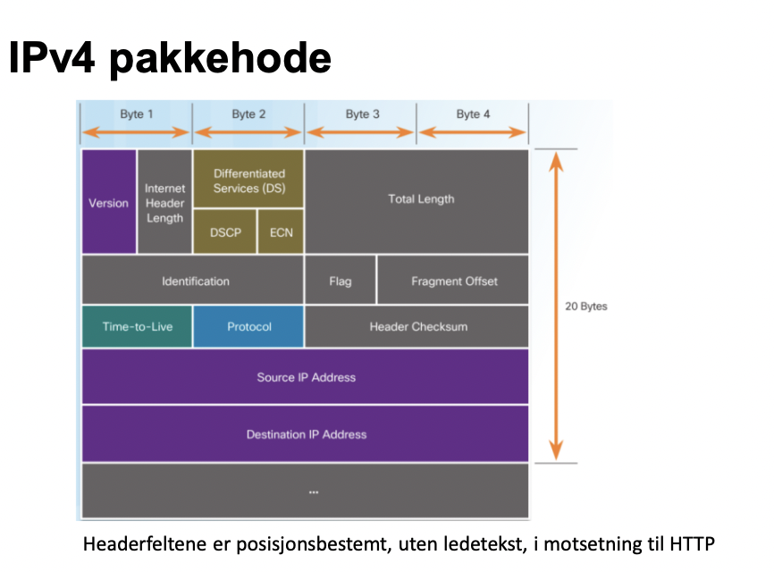
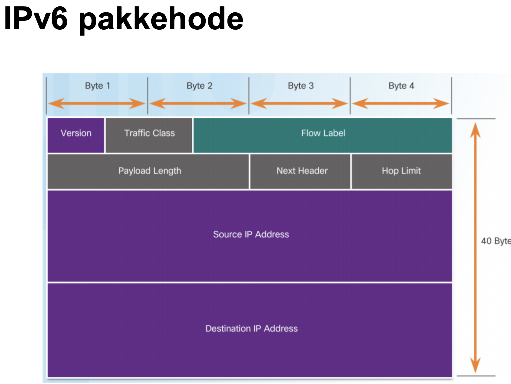
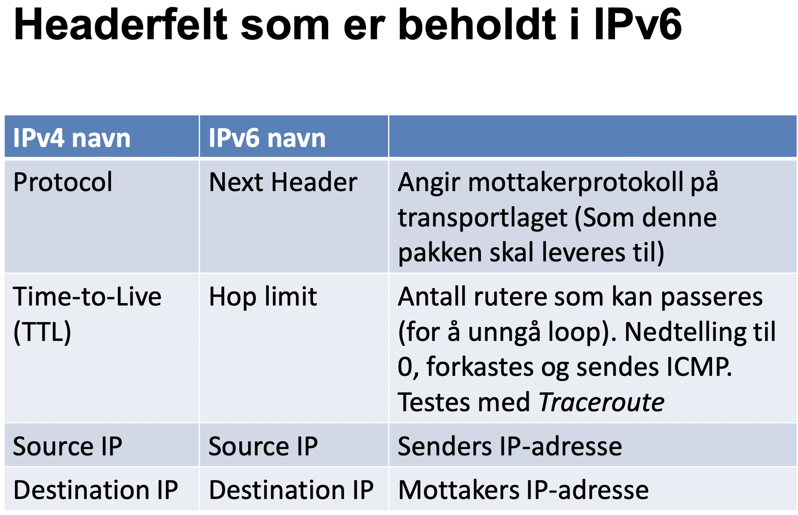
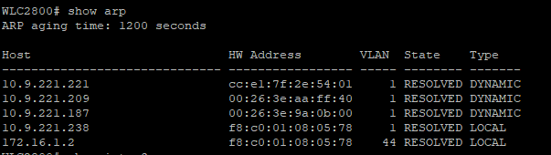

# Oppsummering datakom

# Uke 3 - Applikasjonslaget: Epost, web og navnetjenesten og HTTP

## Webtjenesten

Web tjenesten består av en klient som sender requests til web tjener og får respons tilbake med elementer som den skal vise. En nettside kan være bygget opp av elementer fra flere Web-tjenere.
Nettleseren henter først index-filen og skanner etter referanser til flere objekter som lastes ned i rekkefølge.

### HTTP-standard

HTTP/2 er en forbedring over HTTP/1.1 fordi den er mer effektiv via 2 ting. 

1. Den komprimerer header fielden
2. Den lar flere utvekslinger av informasjon skje på samme tilkobling.

#### Noen egenskaper med HTTP:

* **Den er "stateless"/tilstandsløs**. Dette vil si at den ikke har noe hukommelse og at interaksjoner er uavhengig av hverandre. Hvis man ønsker å ha hukommelse(netthandel, favoritter, osv...) må man bruke cookies/informasjonskapsler.

* **Self-descriptive message payloads**. Hver headerlinje i meldingen har navn og innhold i klartekst. Dette kalles kolonseparerte navn/verdipar. Det er også ingen fast lengde for meldingsheader, som betyr at man kan legge til nye headerlinjer for å støtte ny funksjonalitet.

#### Noen "mangler" som kan jobbes rundt i HTTP

1. **Vedvarende forbindelse**: TCP forbindelsen mellom klient og tjener koples ned etter hver request/response i HTTP/1.1, som regel trenger man flere objekter fra webtjener for å bygge opp en HTML-side. I tillegg sløser det tid og båndbredde å ha en serie av opp/ned koplinger.

    Dette løses ved at klienten kan sende en keep-alive request i headeren, tjeneren kan da svare med en timeout og et maks antall objekter som kan sendes før koplingen termineres.

2. **Cookies**: HTTP/1.1 er tilstandsløs så for å få vedvarende informasjon mellom sesjoner trenger vi cookies.

    Cookies fungerer ved at tjener oppretter en cookie som lagres hos klienten, neste gang klienten sender en request sender den også med cookie.

3. **Lokalt mellomlager(cache)**: Man gjør ofte oppslag på samme webside, objekter fra websiden lagres da i cache på PCen så de ikke må lastes ned hver gang.

    Klienten undersøker eget lager. Hvis den finner filen som skal brukes sender den datoen via - If-modified-since.
    Hvis filen er uendret siden da så svarer tjeneren med HTTP/1.1 304 Not modified. Da bruker pcen opp igjen filen.

4. **Webhotell(Web hosting)**: En webtjener har som regel mange nettsider, men en socket forteller deg ikke hvilken av dem du vil kontakte.

    For å få data fra riktig nettside sender klienten med URL i HTTP-requesten.
    - Host:datakom.no

### utveksling av meldinger

Klient sender en forespørsel(request) med oppbyggingen:

* request line
* Headerlinjer
* Evt. Body

Tjenser svarer(response) med oppbyggingen:

* Status linje (med kode og melding, f.eks 200-OK)
* Headerlinjer
* Body

**Request-linje format:** Method SP request-target SP HTTP-version CRLF

**Status-linje format:** HTTP-versjon SP status-code SP reason-phrase CRLF

SP er mellomrom. CRLF er slutten.

eks: GET /hello.txt HTTP/1.1 -> <- HTTP/1.1 200 OK

### HTTPS

HTTPS er en kryptert versjon av HTTP som bruker TLS "mellom" HTTP og TCP. Det er bare tjeneren som trenger sertfikat. HTTPS fungerer på denne måten:

1. Etablere TCP-forbindelse til tjenerport 443
2. Utveksle TLS-info (klientdata og tjenersertfikat)
3. Avtale sesjonsnøkler (for kryptering av meldinger)
4. Nå kan man starte å sende krypterte meldinger via HTTP standarden.

## DNS - Navnetjenesten

DNS skal finne IP-adressen for et domenenavn. Nettverket trenger IP-adressen for å overføre data. DNS kan også brukes for kontroll, gjøre et reversoppslag for å passe på at IP-adressen har domenenavnet den utgir seg for å ha.

Tjenesten er hierarkisk oppbygd, både i infrastruktur og forvaltning.

infrastruktur: Rottjenere, lokale navnetjenere, ...

forvaltning: Internasjonalt, regionalt, lokal registrering.

### Oppbygging av en URL

eks:

https://www.reddit.com <- Komplett URL

www.reddit.com <- Fully qualified domain name (FQDN)

www <- Sub domain

reddit <- second-level domain
        
com <- Top-level domain (TLD)

Domenenavn brukes av flere tjeneser enn web.
Generiske toppnivå-domener styres av ICANN.
Nasjonale toppnivå-domener styres delegert, eks NORID for no-domenet. Brukerdomener (eks NTNU) tilhører registrert eier som selv kan legge til subdomener (IDI).

Dette bildet viser hvordan DNS søker etter navn.
Rot-tjeneren vet ikke detaljene om det du søker etter, men den vet hvem du skal spørre. Ved å gå gjennom disse rekursivt ender du til slutt opp med.

## Epost

Simple Mail Transfer Protocol (SMTP) er den originale protokollen brukt for mail, denne er veldig simpel og har noen mangler som senere ble adressert via Multipurpose Internet Mail Extensions (MIME).

POP/IMAP er protokoller som blir brukt for å sende mail til klient, SMTP er en protokoll for å sende mail til tjener.

MIME er bare en utvidelse av SMTP som koder om innholder i mailen for å støtte andre tegnsett, vedlegg, ...

### MIME - Formatering av meldingsinnhold

* SMTP bruker US-ASCII tegnsett, 7-bit og meget begrenset.
* Filvedlegg og nasjonale tegnsett må kodes om.

### SMTP dialog med MIME dataformatering

### Oppbygging av en epost

Innholdet i den avsirklede seksjonen er MIME-seksjonen.

# Uke 4 - Transportlaget og digitale sertifikater

Jobben til transportlaget er å passe på at meldinger mellom to applikasjoner kommer frem ende til ende.

### Ende-ende forbindelse mellom applikasjoner

* To program kommuniserer direkte med hverandre, men det kan være flere parallelle/samtidige forbindelser.

* Avsender og mottaker er identifisert med portnummer på transportlaget. Porten er aktiv dersom programmet kjører, dvs "lytter" på porten.

* Maskinene som programmene kjører på er identifisert med IP-adresse. Kombinasjonen Port+IP kalles en socket.

### Adressering

Porter på transportlaget er 16-bit, 64k adresser (65536).

* Velkjente systemporter (0-1023).

* Registrerte porter (1024-49151).

* Dynamiske/private/kortlivde porter (49152-65536).

Porten er KUN aktiv dersom en app lytter på porten.

## TCP og UDP protokollene.

### Pålitelig overføring: TCP

* Omfattende protokoll, pakkehodet er på 20 bytes.

* Deler opp melding i segmenter som sendes hver for seg.

* Settes sammen igjen hos mottaker før meldingen overlates til applikasjonslaget.

* For anvendelser med krav til korrekt innhold, typisk filoverføringer som web.

* Bruker 3 way handshake for å etablere forbindelse.

* Bruker krivttering for å passe på at all data er overført

* Bruker nedkopling for å avslutte forbindelsen.

* Bruker flyt- og metningskontroll. Flytkontroll vil si at man ikke "oversvømmer" mottaker med data. Metningskontroll vil si at man ikke overfører mer data enn nettverket har kapasitet til.

## Upålitelig overføring: UDP

* Enkel og rask protokoll, ingen garantier.

* Pakkehodet er på 8 byte.

* For anvendelser der tidsfaktoren er vesentlig, typisk sanntid eller som DNS.

## kryptografi og sikker kommunikasjon

### Sikkerhetsfunksjoner (CIA) og hva disse innebærer

* Konfidensialitet (confidentiality)
* Integritet (Integrity)
* Autentisitet (Authenticity)

### Kryptografiske metoder

1. Symmetrisk
 * En felles nøkkel kjent av begge parter
 * Standard: AES (Advanced encryption standard). Metoden er kjent, nøkkelen hemmelig
 * fordel: Effektiv bruk av CPU
 * problem: Hvordan få overbrakt nøkkel til motpart

2. Asymmetrisk
* To nøkler, en privat og en offentlig
* Det som krypteres med den ene nøkkelen kan bare dekrypteres med den andre.
* Standard: RSA (Rivest-Shamir-Adleman), er grunnlaget for PKI og digitale sertfikater.
* Fordel: Enkelt å distribuere offentlig nøkkel som motparten bruker til kryptering
* Ulempe: Krevende CPU-belastning

3. Hashing
* Beregner en sjekksum, et digitalt fingeravtrykk, av en melding.
* Sjekksummen har en fast lengde og kan ikke brukes "i revers" for å finne meldingen, enhver endring i melding gir totaly annerledes sjekksum.
* Standarden som brukes heter SHA (Secure hashing algorithm)

### Sertifikat

Innholdet i sertifikatet følger et fastsatt format: X.509

Hensikten med sertifikatet er å autentisere inn  ehaver og distribuere innehavers offentlige nøkkel.

Samtidig må det forsikres om at:
* Sertifikatet er gyldig og ekte
* Sertifikatet er utstedt av en tiltrodd tredjepart (RA/CA)

Sertifikatet er altså bare en liten pakke med data, og det er enkelt å "justere" litt på innholder. Derfor hvilker hele PKI-systemet på at man kan verifisere innholdet.

Til sertifikatet hører det en privat nøkkel som er oppbevart separat fra sertifikatet

### Kontrollere sertifikat

Vi har i sertifikat: 
* Kryptert sjekksum av hele sertifikatet - Kryptert med utsenders private nøkkel
* Hvilke algoritmer som ble brukt for å lage avtrykk
* Navn og adresse på sertifikatutsender (RA/CA)

Dette trenger vi:
* Sertifikatutsenders offentlige nøkkel

Hva gjør vi:
* Henter utsenders sertifikat (for å få offentlig nøkkel)
* Dekoder avtrykk med utsenders offentlige nøkkel
* beregner egen sjekksum og sammenlikner disse

### Sikker kommunikasjon med TLS

bruker web HTTPS som eksempel. Brukerne, som ikke har egne sertifikat, ønsker sikker funksjonalitet mot en webtjener.

#### Kortversjon av hvordan forbindelsen etableres

* klienten ber om forbindelse - Tjener svarer med sitt sertifikat.
* Klient kontrollerer sertifikat, genererer et hemmelig tall som krypteres med sertifikatets offentlige nøkkel og returnerer det. Dette er asymmetrisk krypering (RSA).
* Tjener dekrypterer det hemmelige tallet med sin private nøkkel. Begge parter er nå i besittelse av en felles, hemmelig nøkkel.
* Denne kan brukes videre for symmetrisk kryptering (AES)

Dette er en elegant måte for å distribuere symmetriske nøkler.

# Uke 5 - Nettverkslaget og IP

En IP adresse består av 2 deler: nettadresse og nodeadresse. 

## Subnetting

Et nettverk kan deles opp i subnett, f.eks:

Gitt 192.168.0.0/24 som har 256 adresser og 254 host kan deles i f.eks 3 subett:

* IP-subnett 1: 192.168.0.0/25 (128 adresser)
* IP-subnett 2: 192.168.0.128/26 (64 adresser)
* IP-subnett 3: 192.168.0.192/26 (64 adresser)

Hvert nye subnett må halvere et av de eksisterende subnett-adresserommene.

Når man deler opp i subnett er det på bekostning av at man må ha flere gateway og broadcast adresser (2 per subnett).

## IPv4

### Noen utvalgte felter

* Source og destination IP - 32 bit hver

* Time-to-live - Hvor mange ruterhopp en pakke kan ha før den forkastes.

* protocol - Forteller hvilken protokoll nyttelasten følger

* Checksum - Feildeteksjon i bitoverføring

* Fragment offset + fragment-flagg (lite brukt) - IPv4 kan dele nyttelasten i flere deler dersom lenkelager ikke takler så store pakker. Må settes sammen igjen hos mottaker.

## IPv6

IPv6 trenger ikke nettmaske da disse adressene har mer enn nok bits. IPv6 bruker 64bit til nettadresse og 64bit til nodeadresse.

Headerfelt som er beholdt i IPv6:

### Headerfelt som er endret i IPv4 kontra IPv4:

* IPv6 source IP og destination IP er på 128but hver

* Fjernet checksum - Avsender må holde styr på tapte pakker

* Fjernet fragment-funksjon - Avsender må holde styr på pakkestørrelse

* Innført "Flow label" og "Traffic class" - Mulighet til prioritering av trafikk

# Uke 6 - Nettverkslaget med Rutere, NAT og VPN

Nettverkslaget (L3) bruker lenkelaget (L2) for å sende IP-pakker i ett hopp

* Nettverkslaget - kommuniserer mellom IP-grensesnitt ved å bruke IP-adresser

* lenkelaget - bruker MAC-adresser. Hvert nettverkskort har en fysisk MAC-adresse og alle nettverkskort i et IP-subnet kan sende pakker til hverandre

* Dersom destinasjon IP-adresse ligger innenfor eget subnet kan pakken overføres direkte via MAC-adressen til mottaker

* Dersom destinasjon IP-adresse ligger utenfor eget subnet må pakken først overføres til default gateway

* MAC-adresser finnes med ARP-protokollen

## VPN

Sender kryptert innhold over åpne nett. Går mellom to fast definerte punkter, denne forbindelsen omtales som en tunell.

* Mellom to LAN-lokasjoner: Utføres i rutere på hver ende.

* Mellom PC og LAN: Fra virtuelt nettverkskort på PC. Virtuel adapter opprettes når VPN-klient starter. 

# Uke 7 - Lenkelaget med Ethernet og WiFi
 
## Hva skjer på lenkelaget?

* Lenkelaget sørger for at IP-pakker klargjøres for å kunne sendes ut som elektromagnetiske signaler på ulike fysiske overføringsmedium

* Derfor har lenkelaget todelt struktur:
    * Logisk link kontroll (LLC) mot IP
    * Media access control (MAC) mot det fysiske mediet

* Pakkene (PDU) overføres til et nabo-nettverkskort: IP-destinasjonsadressen avgjør om pakker skal sendes videre eller ikke

* Adresser på lenkelaget kalles MAC-adresser: Media access control, er på 48bit

 